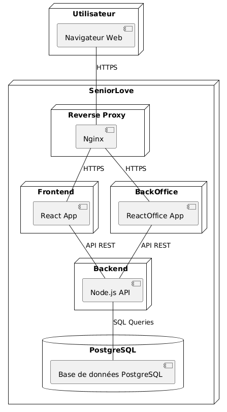
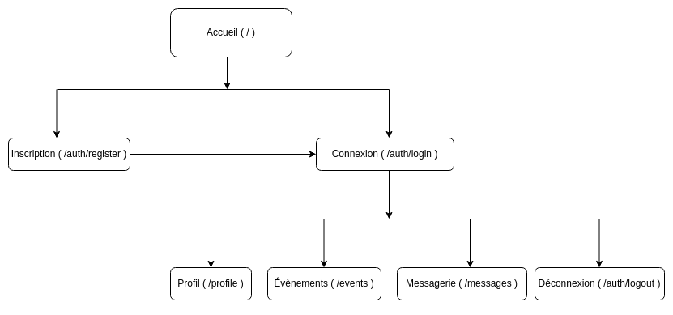

# Cahier des charges du projet SeniorLove

## Présentation du projet

La société "Happy Retired", spécialisée dans les services aux seniors, souhaite lancer sa plateforme de rencontres et d'évènements locaux adressés aux retraités actifs : SeniorLove [Together ?].

Visant à développer la vie sociale des seniors tout en luttant contre l'isolement et la solitude qui surviennent parfois au moment du retrait de la vie active, SeniorLove [Together ?] permet à ses utilisateurs de faire des rencontres authentiques grâce à des évènements diversifiés et des chats privés, le tout au sein d'un réseau sécurisé de profils vérifiés par nos équipes de modération.

Qu'il s'agisse d'entretenir une retraite active ou de préparer sa retraite, SeniorLove [Together ?] est l'application idéale pour maintenir des liens sociaux et vivre de nouvelles expériences.

## Définition des besoins

- Application où les utilisateurs peuvent communiquer par chat privé asynchrone (dans un premier temps, puis évolution vers synchrone)
- Création d'un profil personnalisé (âge, présentation, centres d'intérêt, localisation...)
- Consultation des profils d'autres utilisateurs
- Possibilité pour les utilisateurs de créer, modifier ou supprimer des évènements
- Possibilité pour les utilisateurs de participer et voir la liste des évènements existants (filtres : localisation ou centres d'intérêt)
- Configuration d'un backoffice pour valider/bloquer des utilisateurs et modérer les évènements

## Fonctionnalités du projet

### Minimum Viable Product

Le projet vise à concevoir un site web de mise en relation entre personnes seniors. Il sera centré sur des rencontres autour d'évènements locaux.

Le MVP inclura les modules suivants:

- **Gestion des utilisateurs :**
  - Création de compte (inscription).
  - Connexion et déconnexion sécurisées.
  - Fiche utilisateur avec des informations personnelles et des centres d'intérêt.
  - Modification et suppression du compte.
  
- **Système d'événements :**
  - Création d'un évènement par les utilisateurs.
  - Modification et suppression d'un événement par son créateur.
  - Inscription à un évènement.
  - Consultation des évènements par lieu et/ou par centre d'intérêt.
  
- **Messagerie :**
  - Envoi de messages privés entre deux utilisateurs.
  - Affichage des messages dans un fil de discussion.
  - Système asynchrone (pas de chat en temps réel dans le MVP).
  
- **Back-office de modération :**
  - Interface dédiée aux administrateurs et modérateurs.
  - Possibilité de:
    - Modérer des évènements.
    - Valider ou Bloquer un utilisateur.
  - Accès sécurisé à cette interface selon les rôles.

### Évolutions potentielles

Lors d'une Version 2, on pourra prévoir:  

- Options d'accessibilité (ex : augmenter taille du texte)
- Messagerie instantanée type chat, entre 2 utilisateurs (via websockets).
- Gestion avancée des événements : intégration d'un calendrier interactif pour visualiser clairement les événements à venir.
- Cartographie interactive : visualisation géographique des événements et profils disponibles à proximité.
- Badges ou récompenses virtuelles : valoriser les utilisateurs actifs et impliqués (organisateurs fréquents d’événements, participants réguliers, etc.).

Lors d'une Version 3, on pourra prévoir:

- Possibilité de signaler des contenus inappropriés et des comportements nuisibles.
- Evolution du back-office : gestion des signalements.
- Système de matching avancé basé sur les centres d'intérêts et la localisation.
- Alertes personnalisées : notifications en temps réel ou emails pour prévenir les utilisateurs d’événements pertinents proches de chez eux.
- Système de témoignages et d’évaluations : recueillir les retours utilisateurs sur les événements et les rencontres effectuées.
- Application mobile : optimisation poussée pour l'ergonomie et l'accessibilité afin de faciliter l'usage mobile chez les seniors.

## Architecture du projet

- Reverse proxy qui redirige les requêtes entrantes vers le serveur adéquat après certaines vérifications de sécurité (certificat HTTPS, en-têtes de sécurité) pour plus de sécurité et une meilleure gestion du trafic entrant.
- Frontend (partie client) sous forme de Single Page Application (SPA) pour une expérience utilisateur fluide et réactive, sans rechargement de page, et un débogage facilité pour les équipes de maintenance.
- Backend (partie serveur) composé d'une API Rest pour pouvoir faire des opérations CRUD (Create, Read, Update, Delete) sur les données de la base de données, avec gestion des rôles et permissions des utilisateurs pour définir qui peut manipuler quelles données. Le backend sera organisé selon le pattern architectural MVC (Model-View-Controller)
<!-- - Est ce qu'on peut dire le back en modif MVC? -->
- Base de données relationnelle unique puisque les données seront dans un premier temps toutes sous le même format et que ce système permet une manipulation facile des informations via le langage SQL.
  

## Spécifications techniques

### Versioning

Le projet utilisera les outils de versioning local et distant `git` et `GitHub`, qui permettront de sauvegarder le projet au fur et à mesure des changements tout en le mettant à disposition du reste de l'équipe de développement. Ces outils permettront également d'avoir un historique des changements du code source et de comparer les versions.

### Outils

Pour faciliter le développement sur les différents environnements de travail de l'équipe mais aussi le déploiement une fois le projet livré, on utilisera:

- _Conteneurisation_:
L'application sera conteneurisée à l'aide de **Docker** afin de standardiser les environnements de développement pour tous les membres de l'équipe. Docker permet également d'assurer la portabilité de l'application entre les environnements.

- _Frontend_:
Développé avec React, on utilisera l'outil de build `Vite` pour obtenir un environnement de travail rapide et efficace et des outils utiles comme un serveur local avec rechargement automatique, un transpilateur pour transformer le code de développement en langage navigateur et un bundler pour compresser et optimiser les ressources statiques. 

- _Intégration et déploiement continus_:
Durant le développement et après, sera également mis en place une pipeline CI/CD via `GitHub Actions` afin de maintenir une intégration et un déploiement continus pour une meilleure maintenance et donc, expérience utilisateur.

<!-- TODO diagramme d'activité -->

- _Hébergement_:
Enfin, le projet sera déployé sur le vps mis à disposition par O'Clock.

### Design

Les wireframes seront réalisés sur un logiciel de dessin, tandis que les maquettes seront réalisées sur la solution de prototypage `Figma`, qui inclut de nombreuses fonctionnalités dont celle de réaliser des maquettes interactives et dynamiques qui répliquent fidèlement le parcours utilisateur final et permet aux équipes de travailler ensemble en temps réel. Les assets graphiques seront réalisés ou retouchés via un logiciel de traitement d'image qui offre des fonctionnalités poussées et permet de choisir le format et le poids des images pour améliorer les performances web.

### Tests

Afin d'assurer la fiabilité, la maintenabilité et la qualité globale du projet, une série de test variée sera mise en place:

- _Les Tests fonctionnels de l'API_:
Les tests seront réalisés avec le client HTTP `Insomnia`, qui permettra de lancer des tests fonctionnels sur les endpoints de l'API et de vérifier la bonne exécution du traitement associé. Des tests unitaires seront effectués également grâce au framework `Jest`.

- _Les tests unitaires et fonctionnels du frontend_:
Le front React sera testé avec `Jest`, un framework JavaScript, qui permettra d'écrire les tests unitaires et fonctionnels du front (composants, routes, parcours e2e).

- _Validation de la structure HTML_:
Pour vérifier l'intégrité de la syntaxe HTML, on utilisera le validateur HTML du W3C.

- _Audits de performance et bonnes pratiques_:
L'outil `Lighthouse` permettra de faire des audits de performance, d'accessibilité, de référencement et de bonnes pratiques pour assurer le respect du site aux recommandations officielles.

### Frontend

Le développement de l'interface utilisateur reposera sur une architecture moderne, modulaire et maintenable avec les technologies suivantes:

- HTML: Structure de base des pages de l'application.
- SASS: Mise en forme et personnalisation du design. SASS nous permettra d'utiliser des partials qui rendent le code modulaire et léger.
- React: Une bibliothèque JavaScript pour créer des interfaces utilisateurs.
- Zustand: Une librairie minimaliste de gestion d'état légère mais puissante.
- Typescript: Surcouche typée de JavaScript pour plus de sécurité au développement et un débogage plus rapide des erreurs.

### Backend

Le backend reposera sur un serveur `Express` qui fonctionnera dans un environnement runtime `Node.js` pour permettre l'exécution de code JavaScript coté serveur. Ce serveur exposera une API suivant la convention REST, structurée autour d'opérations CRUD (Create, Read, Update, Delete) et d'une utilisation sémantique du protocole HTTP, facilitant la scalabilité et la flexibilité de l'application en vue d'éventuelles évolutions ou agrandissements.
Pour plus de sécurité au développement et un débogage plus rapide des erreurs, on utilisera le langage `TypeScript`, une surcouche de JavaScript au typage fort.

### Sécurité

- Dans le contexte d'une SPA reposant sur une API, le projet utilisera pour l'authentification des utilisateurs des `jetons JWT` (JSON Web Token) plutôt qu'une session ou des cookies : les JWT sont signés par le serveur, ce qui rend leur falsification impossible, mais ne sont pas gérés par lui, ce qui réduit la charge sur le serveur.
- Pour définir les permissions de chaque rôle, on utilisera le modèle de contrôle d'accès `RBAC (Role-Based Access Control)`. Pour la validation des données reçues du frontend, ce qui est nécessaire à la sécurité de l'application avant tout traitement des données issues du front et leur addition à la base de données, on utilisera le module de validation `Zod`. 
- Suivant les [recommandations de sécurité](https://cheatsheetseries.owasp.org/cheatsheets/Password_Storage_Cheat_Sheet.html) de l'OWASP, les mots de passe et informations sensibles seront hachés avec le module `argon2`.
- Des modules de sécurité spécifiques pour se prémunir de certaines attaques, comme `csrf` contre les attaques CSRF, `sanitize-html` pour nettoyer les entrées utilisateurs, `CORS` pour autoriser les requêtes externes au serveur ou encore `express-rate-limit` pour limiter le nombre de tentatives de connexion pour une IP donnée, seront utilisés pour renforcer la sécurité de l'application.

### Base de données

La base de données unique utilisera le SGBDR `PostgreSQL`, en s'appuyant au besoin sur des index pour réduire le temps de chargement de requêtes les plus utilisées. Pour simplifier l'écriture de requêtes complexes, maintenir un code DRY et gérer nativement les requêtes préparées contre les injections SQL, on utilisera l'ORM (Object Relational Model) `Sequelize`. De plus, Sequelize permettra de sécuriser l'intégrité des données insérées en base de données grâce à ses modèles de types et d'associations. Dans le cas où les requêtes seront trop complexes pour Sequelize, on basculera exceptionnellement sur des requêtes `SQL` ou `PGSQL` (extension du langage SQL liée à PostgreSQL).

<!-- ? mentionner les fonctions SQL ? -->

## Cible du projet/public visé

Le public visé par ce projet regroupe les actifs en pré-retraite et les retraités actifs de plus de 60 ans, qui souhaitent maintenir leur rythme de vie et rencontrer de nouvelles personnes partageant leurs centres d'intérêt (sociaux, intellectuels, créatifs, sportifs) via des évènements locaux de toutes sortes, le tout dans un contexte sécurisé et vérifié par les équipes SeniorLove.

## Navigateurs compatibles

La plateforme prévoit d'être disponible sur tous les navigateurs (desktop et mobile):

- Firefox (version 140)
- Chrome (version 138)
- Safari (version 18.6)

Et, à long terme, d'être disponible sous forme d'application mobile (Android, iOS).

## Arborescence d'application (front)

Pages disponibles :

## Liste des routes prévues (back)

### Visiteurs

- **GET** `/`
- **POST** `/auth/register & login`

### Membres

- **GET** `/`
- **POST** `/auth/register & login`

- **GET** `/profiles`
- **GET** `/profiles/:id`

- **GET** `/events`
- **GET** `/events/:id`
- **POST** `/events`
  
Pour leur profil:

- **UPDATE** `/profiles/:id`
- **DELETE** `/profiles/:id`

Pour leur évènements:

- **UPDATE** `/events/:id`
- **DELETE** `/events/:id`

### Modérateurs

### Administrateurs

- **GET** `/`
- **POST** `/auth/register & login`
  
- **GET** `/profile`
- **UPDATE** `/profile`
- **DELETE** `/profile`

- **GET** `/users/`
- **GET** `/users/:id`

- **GET** `/events`
- **POST** `/events`
- **UPDATE** `/events`
- **DELETE** `/events`

- **GET** `/messages`
- **POST** `/messages`

## User stories

| En tant que | Je souhaite | Afin de |
|---|---|---|
|Visiteur|consulter la page d'accueil||
|Visiteur|s'inscrire|accéder aux fonctionnalités du site|
|Membre|se connecter / se déconnecter|accéder à mes fonctionnalités de membre|
|Membre|consulter / modifier son profil|accéder à mes informations personnelles|
|Membre|supprimer son profil|supprimer mes informations personnelles|
|Membre|créer / modifier un évènement||
|Membre|supprimer un évènement||
|Membre|afficher un évènement|avoir des détails sur un évènement particulier|
|Membre|filtrer les évènements existants par centre d'intérêt et/ou localisation|trouver des évènements qui m'intéressent|
|Membre|s'inscrire / se désinscrire à un évènement||
|Membre|écrire / recevoir un message|avoir une conversation avec un autre utilisateur|
|Modérateur|valider un profil|autoriser l'accès d'un nouveau membre au site|
|Modérateur|bloquer un profil|refuser l'accès d'un nouveau membre au site|
|Modérateur|modifier un évènement|modérer un évènement existant|
|Modérateur|supprimer un évènement|modérer un évènement existant|
|Administrateur|créer et gérer les évènements||
|Administrateur|créer et gérer les utilisateurs||

## Analyse des risques

- Risques juridiques / réglementaires : nouvelles lois, évolutions des lois existantes (RGPD)
- Risques organisationnels : mauvaise répartition des rôles, manque de communication, dépassement des délais, manque des compétences nécessaires, absence ou indisponibilité des acteurs, changement des demandes client en cours de projet
- Risques financiers : mauvaise gestion du budget, réduction du budget alloué
- Risques psychosociaux : stress, burnout, conflits dans l'équipe, fatigue
- Risques informatiques/numériques : mauvaise compatibilité ou installation des environnements, panne de serveur, performances faibles, référencement SEO insuffisant, perte de données, cyber-attaques, violation de confidentialité des données, évolution des technologies (obsolescence des technologies utilisées)
- Risques de sécurité : injections de code malveillant (XSS, SQL), mauvaise gestion des rôles et permissions utilisateur, non-respect du RGPD et de la confidentialité des données, mauvaises configurations de sécurité, vol de tokens d'authentification, attaques CSRF, composants ou modules vulnérables et non tenus à jour

<!-- ? vol === usurpation de token d'authentification ? -->

## Liste des rôles

Dans l'équipe de développement, les rôles sont les suivants :

- Product Owner : Cheikna COULIBALY
- Scrum Master : Ambre MALET
- Lead Devs : Coralie POISSON ( back & spécialité : SQL ) et Kannann BHANLIN ( front & spécialité: sécurité )
